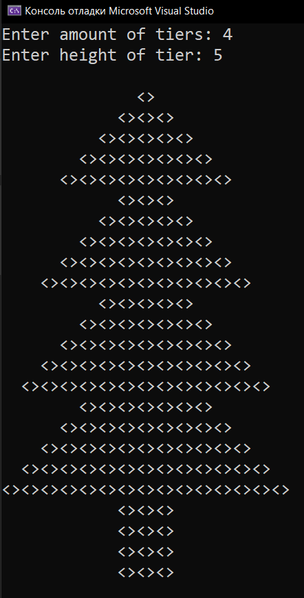
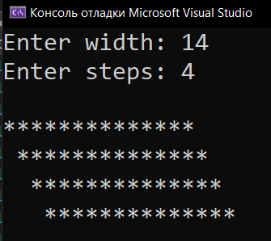
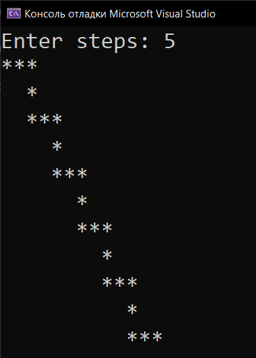

# Homework_14_Loop
Д/з: Loop

<a href="https://gist.github.com/SlavikArt/26378df36a079dbe96cfd027c1f8a915">Gist - страница со всеми кодами проектов</a>

* [Christmas_Tree](Christmas_Tree)
* [Stairs_One](Stairs_One)
* [Stairs_Two](Stairs_Two)

    <h2>Christmas tree</h2>
    
Yalinka.

    
    <h2>Stairs one</h2>
    
Just stairs #1.

    
    <h2>Stairs two</h2>
    
Just stairs #2.

    

